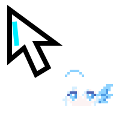

# `sprite/companion.json`, `pointer/pointer.json`: cursor companion

The managed pointer and its pixel companion, kept apart from the native code so the art can be
edited without touching `implant.cpp`. `implant.cpp` includes the generated header from here;
[cortico-world-canvas](https://github.com/Phantivia/cortico-world-canvas) carries a copy of the
generated SVG for its web cursor.

<p>
  
  
</p>

## Files

| Path | Content |
|---|---|
| `sprite/companion.json` | The sprite source: palette, 24 rows of pixel indices, four animations, draw offset |
| `pointer/pointer.json` | Pointer geometry: arrow polygon, cyan pulse line, press ring, companion placement, edge flip |
| `scripts/generate.mjs` | Writes `generated/` from the two JSON files; `--check` compares without writing |
| `generated/cursor_companion.h` | C++17 header, namespace `pvz::cursorCompanion`; included by `src/native/implant.cpp` |
| `generated/companion.svg` | One `<rect>` per opaque pixel; the canvas World's cursor image |
| `generated/companion.png`, `generated/companion@8x.png` | Bitmaps at 1× and 8× nearest-neighbour |
| `generated/pointer.svg` | 1:1 composite preview of pointer and companion |

`generated/` is committed; regenerate after editing a source. The header ends with
`static_assert`s pinning the FNV-1a hash of the pixel data, the opaque pixel count and each
animation's total duration, so a header that no longer matches its source fails to compile.
The native build identity (`src/native-build.ts`) covers the generated header, so an edit here
triggers a rebuild of the injector and implant.

## Sprite

- 24 × 24, seven palette entries; index 0 is transparent and written `.` in `pixels`, indices 1–6
  are the six colours.
- Drawn at `(20, 20)` from the pointer hotspot, lower right. When the hotspot is within
  `20 + 24 + 1` pixels of the right or bottom client edge, that axis flips to the other side and the
  arrow mirrors with it.
- Four animations, integer offsets only, no scaling or interpolation:

| State | Frames `[dx, dy, ms]` | Loops |
|---|---|---|
| idle | `[0,0,280] [0,-1,180] [1,-1,320] [0,0,180]` | yes |
| moving | `[0,0,60] [1,-1,60] [0,-1,60] [-1,0,60]` | yes |
| pressed | `[0,0,45] [0,1,75] [0,1,120]` | no, holds the last frame |
| released | `[0,0,55] [0,-1,75]` | no, holds the last frame |

The implant draws a black outline around the sprite (every transparent pixel adjacent to an opaque
one) before filling the pixels.

## Pointer

Coordinates are relative to the hotspot (arrow tip) in client pixels. The arrow is a seven-point
polygon, white with a 2-pixel black outline; a 2-pixel cyan (`#00eeff`) line runs from `(2, 5)` to
`(3, 15)` and extends downward by the state's pulse value; while a button is down a hollow cyan
ring of radius `9 + pulse` is drawn around the hotspot. Pulse: idle 0, moving 1, pressed and
dragging 2, released 2 for the first 55 ms then 1.

## Regenerating

```bash
node cursor-companion/scripts/generate.mjs          # write generated/
node cursor-companion/scripts/generate.mjs --check  # compare; exit 1 when stale
```

Copy `generated/companion.svg` to `cortico-world-canvas/src/public/corti-cursor.svg` after a
sprite change; the header needs no copying.
